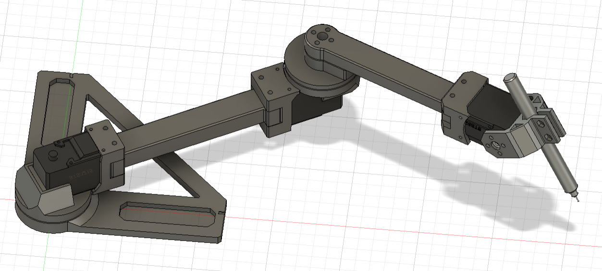

# BSL-Plotter



## Environment
- Ubuntu 20.04
- docker, docker compose

[NOTE]
This repository DOES NOT support NVIDIA graphic driver.

## Installation
### Hardware
The BSL-Plotter parts are in the `bsl-plotter/stl` directory. Please refer to URDF model and above image for assembly. And, use 6mm BB-bullets-ball to assemble the thrust bearings.
(3D model for assembly will be uploaded soon!)

It is recommended to use a 3D printer to create the parts. The recommended printing conditions are as follows.
- Nozzle: 0.4mm
- Filament: ABS, PLA, PETG
- Support: enable
- Wall: 0.6~1.0mm

**BOM**
| Item | Model | Quat. | Link |
| --- | --- | --- | --- |
| Servo Motor    | STS3215, Feetech   | 3 pcs. | [akitsuki](https://akizukidenshi.com/catalog/g/gM-16312/) |
| Servo IF Board | FE-URT-1, Feetech  | 1 pc   | [akitsuki](https://akizukidenshi.com/catalog/g/gM-16295/) |
| Filament | PolyTerra PLA, Polymaker | 1 roll | [Amazon](https://amzn.to/4028WbJ) |
| Magnet | コクヨ マグネット 強力マグネットプレート 片面・粘着剤付き 6枚 耐荷重500g マク-S381 | 1 pack | [Amazon](https://amzn.to/3FkPehZ) |
| White board | トレー付大きなホワイトボード ４５×６０ｃｍ   | 1 pc | [DAISO](https://jp.daisonet.com/products/4549131460452?_pos=28&_sid=489c126bd&_ss=r) |
| Pen | ホワイトボードマーカー（消し付、細芯、黒・赤・青、３本） |  1 pack | [DAISO](https://jp.daisonet.com/products/4549892198038?_pos=15&_sid=5683c238f&_ss=r) |
| BB-Ball (for thrust bearing unit) | BB弾 | 1 pack | [DAISO](https://jp.daisonet.com/products/4549131354997) |
| Wire | 3 core cable | about 1 m | | 
| Bolt | M2 tapping |  | included STS3215 |
|      | M3-5mm  |  | included STS3215 |
|      | M3-10mm | 4 pcs. | |
|      | M3-15mm | 2 pcs. | |
|      | M3-25mm | 4 pcs. | |
|      | M3-30mm | 2 pcs. | |
|      | M3-35mm | 4 pcs. | |
|      | M3-40mm | 4 pcs. | |
| Nuts | M3 Hex  | 20 pcs. | |

**Servo ID Setting**
- Root Joint: 1
- Middle Joint: 2
- Hand Joint: 3

**Cable Extension**
Extend the cable included with STS3215 to double the length. You can use a connector or solder it.

### Software

1. [pixi](https://pixi.sh/) のインストール(Linux or Mac)
    ```bash
    curl -fsSL https://pixi.sh/install.sh | bash
    source ~/.zshrc
    ```

1. リポジトリのクローン
    ```
    git clone https://github.com/kim-xps12/bsl-plotter.git
    cd bsl-plotter
    git checkout ros2_pixi
    ```

1. ROS 2ワークスペースに移動
    ```bash
    cd ros2_ws
    ```

1. pixi環境をセットアップ（初回のみ）
    ```bash
    pixi install
    ```

1. パッケージをビルド
    ```bash
    pixi run colcon build --symlink-install
    ```

### Usage

**RViz2でロボットモデルを表示（GUI付きジョイントスライダー）**
```bash
pixi run ros2 launch bsl_plotter_description display.launch.py
```

**テストスイングデモを実行**
```bash
pixi run ros2 launch plotter_controller test_swing.launch.py
```

**ハードウェア制御（実機接続時）**

ターミナル1: RViz2でロボットを表示（GUIスライダーなし）
```bash
pixi run ros2 launch bsl_plotter_description display.launch.py gui:=false
```

ターミナル2: サーボドライバを起動
```bash
pixi run ros2 run plotter_controller feetech_driver.py
```

ターミナル3: テストスイングを実行
```bash
pixi run ros2 run plotter_controller test_swing.py
```

---

## ROS 1 Noetic (Legacy)

> **Note**: ROS 1版は非推奨です。新規利用はROS 2 Jazzy版を推奨します。

You need to operate inside a docker container (*mynoetic*).
It is required to be able to use multiple terminals using *tmux* or *terminator*. I recommend reading "How to use Terminator" in the Reference section.

1. Go workspace
    ```
    cd catkin_ws
    ```
1. Build workspace and load settings
    ```
    catkin build
    source devel/setup.bash
    ```

1. Launch rviz
    ```
    roslaunch bsl_plotter_description display.launch
    ```
1. Add new pane, and Launch IK solver
    ```
    roslaunch plotter_controller test_swing.launch
    ```
1. Add new pane, Run servo driver
    ```
    rosrun plotter_controller feetech_driver.py
    ```

---

## Reference
[How to use Terminator](terminator/how_to_use_terminator.md)
